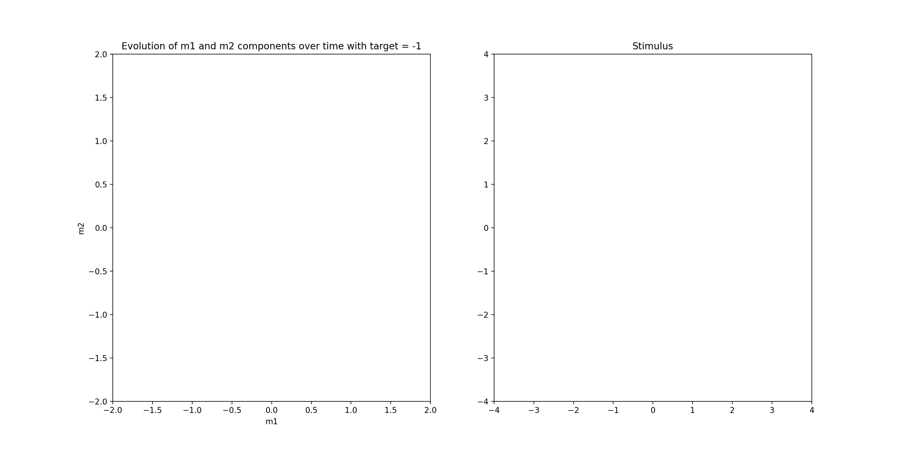

<p align="center"><b><i>
	Low-rank RNN
</b></i></p>

<div align="center">


[](https://github.com/astral-sh/ruff)
[](https://github.com/astral-sh/ty)

</div>


## Go - NoGo

I generated synthetic stimuli data for simulating a Go-NoGo task and trained a rank-two RNN on it.

```shell
pip install -r requirements.txt
python -m low_rank_rnn.train
```

&rarr; We see that the neurons activity lies on a 1D-manifold:

### Go

### NoGo
